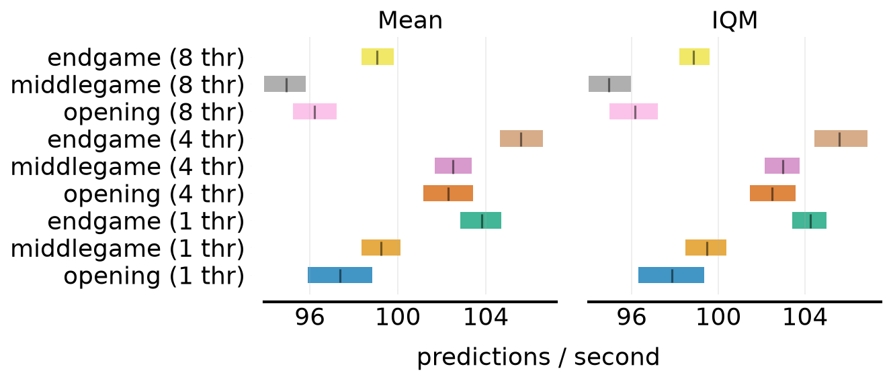

# Inference throughput by game phase

Full-chain `MatildaModel.predict` (Maia-3 23M -> featurize -> re-ranker)
on Apple M3 Pro, Darwin 25.5.0, torch 2.13.0, device=cpu.
Positions: rated blitz games, lichess_db_standard_rated_2026-06.pgn.zst (2026.06.01...), sampled per ply tranche with real history/Elos/TC. Intervals: rliable stratified bootstrap (2000 reps), mean [95% CI].

| tranche | threads | n | pred/s mean [95% CI] | IQM [95% CI] |
|---|---|---|---|---|
| opening | 1 | 50 | 97.37 [95.90, 98.83] | 97.87 [96.30, 99.35] |
| middlegame | 1 | 50 | 99.23 [98.35, 100.11] | 99.49 [98.49, 100.39] |
| endgame | 1 | 50 | 103.81 [102.83, 104.70] | 104.27 [103.40, 105.00] |
| opening | 4 | 50 | 102.30 [101.16, 103.41] | 102.48 [101.44, 103.56] |
| middlegame | 4 | 50 | 102.52 [101.68, 103.37] | 102.98 [102.13, 103.75] |
| endgame | 4 | 50 | 105.60 [104.64, 106.59] | 105.59 [104.42, 106.88] |
| opening | 8 | 50 | 96.22 [95.23, 97.23] | 96.15 [94.98, 97.20] |
| middlegame | 8 | 50 | 94.91 [93.93, 95.82] | 94.96 [94.02, 95.98] |
| endgame | 8 | 50 | 99.04 [98.36, 99.82] | 98.87 [98.21, 99.60] |

